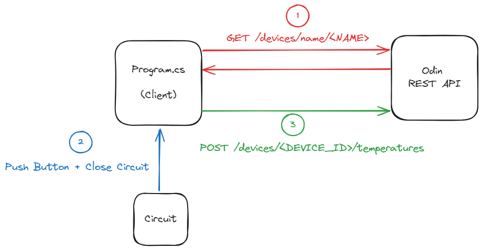
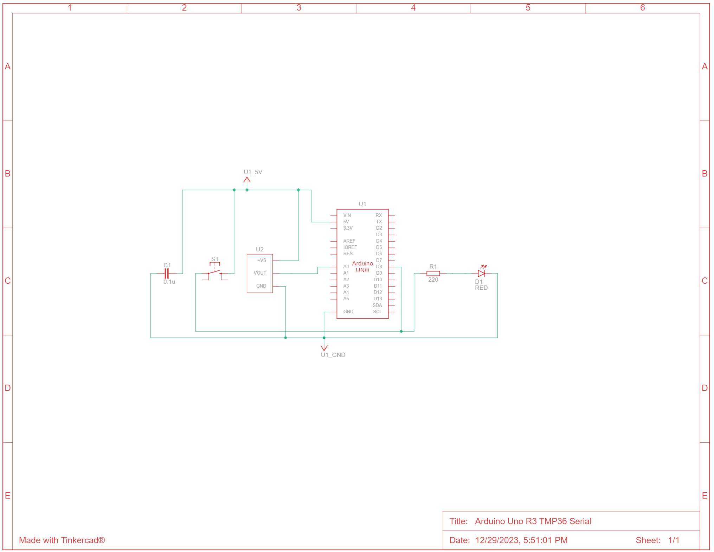
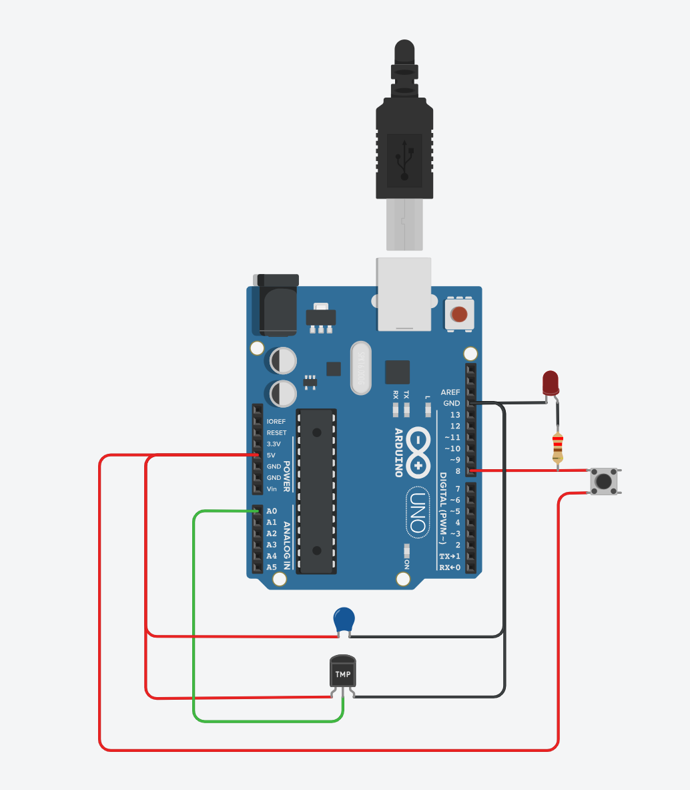

# Arduino Uno R3 TMP36 Button Serial

## Description

This project uses an [Arduino Uno R3](https://docs.arduino.cc/hardware/uno-rev3) connected to a [TMP36](https://www.analog.com/media/en/technical-documentation/data-sheets/tmp35_36_37.pdf) sensor circuit to read the temperature in degrees Celsius. The temperature is read when a physical push button is pressed and closes the circuit (software debounced). This temperature along with other information is sent over a serial connection using the [ArduinoJson](https://arduinojson.org/) library to an external device running [`Program.cs`](./Program.cs) to send the data to the main [REST API](/Odin.Api/).

The program flow can be seen in the following diagram:



1. `Program.cs` sends a `GET` request to the REST API for the current `Device` information which we will take the ID from.
2. When the push button is pressed and closes the circuit, the Arduino reads the temperature from the TMP36 sensor and sends the data to the client over serial connection.
3. The client receives the data and sends a `POST` request to the REST API with this temperature entry.

Note: Step 1 is unideal as we have to know the name of the device beforehand. Future improvements could look to register (or obtain) the device with the REST API and receive an ID back using some unique identifier (e.g. MAC address).

## Running the Client (Program.cs)

```shell
dotnet run <PORT>
```

| Argument | Description                                                |
| -------- | ---------------------------------------------------------- |
| `PORT`   | The serial port the Arduino is connected to (e.g. `COM3`). |

## Circuit - Parts List and Diagram

| Name | Quantity | Component                  |
| ---- | -------- | -------------------------- |
| U1   | 1        | Arduino Uno R3             |
| U2   | 1        | Temperature Sensor (TMP36) |
| D1   | 1        | LED                        |
| R1   | 1        | 220 Ohm Resistor           |
| C1   | 1        | 0.1 uF Capacitor           |
| S1   | 1        | Pushbutton                 |




## Aside - Using the TMP36 Sensor to Obtain Temperature

There are two steps we have to take to obtain the temperature from the TMP36 sensor:

1. Convert the analog value read from the ADC to a voltage value
2. Use this voltage value to calculate the temperature in degrees Celsius

An Arduino has a 10 bit resolution ADC which is 2^10 = 1024 different values. Given a 5V reference voltage (Vref) and an ADC value (ADC) acquired through `analogRead()`, we can calculate the analogue input voltage: `V = (ADC * Vref) / 1024 = (ADC * 5.0) / 1024`.

The TMP36 datasheet states:

- It has a linear scale factor of 10mV/°C, meaning voltage is a linear function of temperature.
- A 500mV offset (0°C, 0.5V)
- Two clear data points: (25°C, 0.75V) and (50°C, 1.0V)

We can model this as: `v(t) = mt + c` where `v` is the voltage in Volts, `t` is the temperature in degrees Celsius, `m` is the gradient (scale factor) and `c` is the y-intercept (offset voltage of 0.5V).

We can check that `m` represents 10mV/°C (`m=0.01`) by using the two data points:

```text
m = rise / run
  = (1.0 - 0.75) / (50 - 25)
  = 0.01
```

Therefore giving us the equation: `v(t) = 0.01t + 0.5`.

If we are given a voltage value, we can rearrange the equation to find the temperature: `t = (v - 0.5) / 0.01`.

```text
v = 0.01t + 0.5
t = (v - 0.5) / 0.01
t = 100v - 50
```

Which we plug in the voltage value from step 1 to obtain the temperature in degrees Celsius.
